# Freehunter AI Acquisition System

This project is a local-first MVP for semi-automating freelance job acquisition from Freehunter.

## Current Safety Boundary

The app does not send emails, submit forms, apply to jobs, or contact clients automatically. It only:

1. Crawls Freehunter job data.
2. Fetches client email addresses.
3. Scores jobs for AI-assisted feasibility.
4. Generates draft outreach copy.
5. Stores local workflow decisions.
6. Lets a human copy, edit, approve, and log communications.

The intended next boundary is: approved drafts may be handed to an email adapter, but every external send must write a communication event back to the opportunity timeline.

## Components

- `server.js`: local HTTP server, Freehunter API proxy, analysis engine, local JSON store, approval endpoints.
- `public/`: dashboard UI.
- `data/store.json`: local CRM/workflow store generated at runtime. It is ignored by git.
- `scripts/run-pipeline.mjs`: cron/Hermes-friendly runner for daily crawl and analysis.

## Pipeline

```mermaid
flowchart LR
  A["Freehunter getAllJobs"] --> B["Filter latest 30 days"]
  B --> C["getClientEmail per unique client"]
  C --> D["Rule-based analysis"]
  D --> E{"Provider enabled?"}
  E -- no --> F["Local result"]
  E -- yes --> G["OpenRouter/OpenAI premium review"]
  G --> F
  F --> H["Local store merge"]
  H --> I["Dashboard approval queue"]
  I --> J["Human approve/edit"]
  J --> K["Create project workspace"]
  K --> M["Hermes handoff bundle"]
  M --> N["Hermes manager"]
  N --> O["Codex worker when delivery is needed"]
  N --> P["Email/WhatsApp adapter after approval"]
  O --> Q["Deliverables + worker handoff"]
  P --> L["Communication timeline"]
  Q --> L
```



## Agent Roles

- Dashboard: source of truth and control room. It owns job status, drafts, approvals, project notes, and communication history.
- Hermes Agent: best fit for always-on manager duties such as daily crawl, checking approved drafts, sending through an email adapter, polling inboxes, consolidating questions, and writing events back to the dashboard API.
- Codex: best fit for deep work and project delivery. Each won job can create a project folder with `brief.md`, `conversation.md`, `tasks.md`, `worker-prompt.md`, `questions.md`, `progress.md`, and `handoff.md`.
- OpenRouter/OpenAI model calls: scoring, drafting, summarizing replies, and generating worker plans. They should not directly send messages.

The clean rule is: agents can propose and execute configured actions, but the dashboard remains the ledger.

## Project Workspace Contract

The dashboard creates one folder per accepted opportunity:

```text
projects/<job-id-title>/
  brief.md
  conversation.md
  tasks.md
  worker-prompt.md
  questions.md
  progress.md
  handoff.md
  manager-flow.md
  source/
  deliverables/
```

Hermes should treat this folder as the working contract for that client project. Codex should only work inside that folder unless Jack explicitly authorizes a broader change.

## Hermes Handoff

Clicking `Pass to Hermes Agent` creates or syncs the project workspace, then creates a handoff bundle:

```text
data/hermes-outbox/<job-id-title>/
  handoff.json
  handoff.md
  worker-prompt.md
```

Modes:

- `file`: write the outbox bundle only. Best first step and easiest to move to another machine.
- `webhook`: POST the JSON bundle to `HERMES_AGENT_WEBHOOK_URL`.
- `both`: write files and POST webhook.

The webhook payload includes dashboard API paths, owner contact, job/client data, project folder paths, AI analysis, the current draft, manager instructions, and the Codex handoff rule.

Hermes is allowed to manage internal state and prepare messages. Hermes should not send client-facing email or deliverables unless the dashboard/Jack approval state allows it.

## Workflow States

- `new`: imported but not acted on.
- `shortlisted`: worth reviewing.
- `needs_info`: draft should ask clarifying questions.
- `drafted`: draft edited locally.
- `approved`: human approved draft, but email is still not sent.
- `sent`: outbound communication logged or future email adapter confirmed a send.
- `replied`: inbound communication logged.
- `won`: manual record only.
- `lost`: manual record only.
- `archived`: not worth pursuing now.

## LLM Provider Strategy

Default mode is `rule`, which is free and deterministic.

Recommended production mode:

1. Use `rule` or OpenRouter cheap models for broad triage.
2. Use OpenAI direct or a stronger OpenRouter model only for high-score jobs.
3. Keep `LLM_TRIAGE_MAX_JOBS`, `LLM_DAILY_USD_CAP`, and `LLM_MONTHLY_USD_CAP` conservative.
4. Do not enable automatic sending until approvals, logs, and cost reports are boringly reliable.

## Data Model

`data/store.json` contains:

- `clients`: client name, email, related job ids.
- `opportunities`: per-job pipeline status, notes, manual quote, draft, project state, and history.
- `opportunities[*].events`: timeline entries for approvals, sent emails, WhatsApp notes, inbound replies, project updates, and future agent actions.
- `llmUsage`: estimated or actual model review usage.
- `runs`: recent crawl summaries.

This is intentionally simple. If the workflow becomes valuable, migrate this store to Supabase/Postgres.
